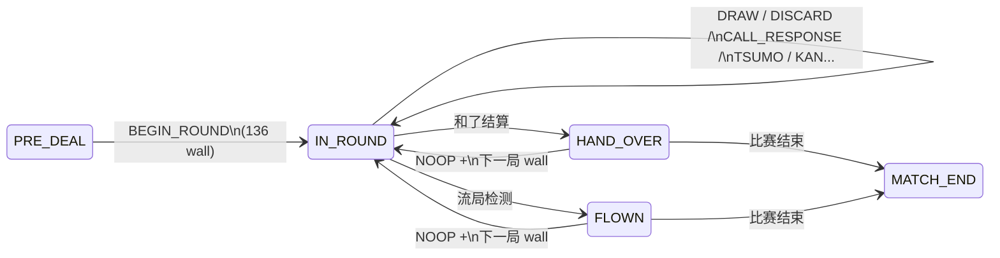

# AIma 麻将内核：组成与状态流向

本文描述 `src/kernel/` 日麻对局内核的**模块划分**、**核心数据对象**与**状态机流向**。运行时规则以代码为准；人类可读规则条文见仓库 `mahjong_rules/`（不参与裁决）。

---

## 1. 设计原则

1. **唯一推进入口**：结构化事件。局面变更只应通过 `kernel.engine.apply.apply(state, action) -> ApplyOutcome` 完成，得到新的 `GameState` 与当步
2. **内核不依赖上层**：`kernel` 禁止 import `llm` 或 UI；编排层（多 seat、HTTP、超时）放在内核之外。
3. **合法动作由规则枚举**：对外提供 `kernel.api.legal_actions.legal_actions` 作为「当前席可执行动作」的参考实现；**模型输出必须再经 `apply` 校验**（`IllegalActionError` 表示拒绝）。
4. **张数守恒**：标准四麻 136 张；`BoardState` 在构造时通过 `validate_board_state` 校验门内、副露、河、本墙与王牌存量之和。

---

## 2. 顶层对象一览

| 对象                      | 模块                      | 含义                                                                            |
| ----------------------- | ----------------------- | ----------------------------------------------------------------------------- |
| `GameState`             | `kernel.engine.state`   | 对局根状态：阶段、场况表、可选牌桌快照 `board`、和了者/流局附加字段、事件序号                                   |
| `TableSnapshot`         | `kernel.table.model`    | 场风、局序、亲席、本场、供托、四家点棒等（**不含**手牌与牌山）                                             |
| `BoardState`            | `kernel.deal.model`     | 一局进行中的牌桌：四家手牌与副露、本墙、王牌、河、`current_seat`、`turn_phase`、鸣牌窗口 `call_state`、立直/一发等 |
| `Action` / `ActionKind` | `kernel.engine.actions` | 提交给 `apply` 的单步意图                                                             |
| `ApplyOutcome`          | `kernel.engine.apply`   | `new_state` + 本步 `events`（事件日志）                                               |

初始对局：

- `initial_game_state(table=None)`：`GamePhase.PRE_DEAL`，`board is None`；`table` 缺省为半庄默认场况（`initial_table_snapshot()`）。

---

## 3. 阶段：`GamePhase` 与局内子阶段 `TurnPhase`

### 3.1 `GamePhase`（引擎顶层阶段）

| 阶段              | 说明                                                                                                                |
| --------------- | ----------------------------------------------------------------------------------------------------------------- |
| `PRE_DEAL`      | 尚未配牌；仅允许 `BEGIN_ROUND`（附带 136 张标准牌山）                                                                              |
| `IN_ROUND`      | 局中；具体能做什么由 `board.turn_phase` 决定                                                                                  |
| `CALL_RESPONSE` | **不单独出现**：局内应答窗口通过 `IN_ROUND` + `turn_phase == CALL_RESPONSE` 表达                                                  |
| `HAND_OVER`     | 一局和了结束（荣和/自摸），等待进入下一局或比赛结束                                                                                        |
| `FLOWN`         | 流局（含听牌结算后的表更新），等待进入下一局或比赛结束                                                                                       |
| `MATCH_END`     | 整场比赛结束；**不再接受 `apply`**（再调用会抛 `IllegalActionError`）。另：`legal_actions` 在此阶段仍可能返回 `NOOP`，仅供占位，**勿对终局状态调用 `apply`**。 |

### 3.2 `TurnPhase`（`IN_ROUND` 内）

| 子阶段             | 典型持有张数（当前行动家 / 他家）           | 含义                                                |
| --------------- | ---------------------------- | ------------------------------------------------- |
| `NEED_DRAW`     | 各家 13 / 13 / 13 / 13         | 当前家须从本墙摸牌                                         |
| `MUST_DISCARD`  | 当前家 14（岭上摸后亦可能经杠序进入 15 张再打出） | 须打牌，或可声明立直、自摸和、暗杠/加杠（规则允许时）                       |
| `CALL_RESPONSE` | 依鸣牌/荣和窗口而定                   | 他家对刚打出（或加杠）的牌表态：`PASS_CALL` / `RON` / `OPEN_MELD` |

舍牌应答的细节状态在 `kernel.play.model.CallResolution`：`stage` 依次为 `ron` → `pon_kan` → `chi`；支持**一炮多响**、**同巡振听**（`ron_passed_seats`）、**抢杠**（`chankan_rinshan_pending` 等）。

---

## 4. 动作模型：`ActionKind` 与 `Action`

`Action` 为 frozen dataclass，主要字段：

- `kind: ActionKind`
- `seat: int | None`（0..3；部分动作必填）
- `wall: tuple[Tile, ...] | None`：`**BEGIN_ROUND` 必填**；在 `**HAND_OVER` / `FLOWN` 下若用 `NOOP` 开下一局时，也需传入下一局的 136 张牌山**（见下文「局间推进」）
- `tile: Tile | None`：`DISCARD` 必填；`RON` 在实现里与舍牌一致，通常由应答上下文约束
- `declare_riichi: bool`：与 `DISCARD` 联用
- `meld: Meld | None`：`OPEN_MELD` / `ANKAN` / `SHANKUMINKAN` 必填

动作种类摘要：

| `ActionKind`                      | 允许阶段（摘要）                                                                      |
| --------------------------------- | ----------------------------------------------------------------------------- |
| `BEGIN_ROUND`                     | `PRE_DEAL`                                                                    |
| `NOOP`                            | `IN_ROUND` 恒等；`HAND_OVER`/`FLOWN`/`MATCH_END` 在 `legal_actions` 中可出现（终局前用于推进） |
| `DRAW`                            | `IN_ROUND` 且 `NEED_DRAW`，且一般为 `current_seat`                                  |
| `DISCARD`                         | `IN_ROUND` 且 `MUST_DISCARD`，`seat == current_seat`                            |
| `PASS_CALL` / `RON` / `OPEN_MELD` | `IN_ROUND` 且 `CALL_RESPONSE`，且须满足 `CallResolution` 轮到的席                       |
| `TSUMO`                           | `IN_ROUND` 且 `MUST_DISCARD`，且存在合法自摸形（含岭上 15 张路径等）                             |
| `ANKAN` / `SHANKUMINKAN`          | `IN_ROUND` 且 `MUST_DISCARD`（立直后禁止加杠等由转移函数约束）                                  |

非法组合统一抛出 `kernel.engine.apply.IllegalActionError`（`EngineError` 子类）。

---

## 5. `apply` 状态流向（文字 + 简图）

### 5.1 开局

`PRE_DEAL` + `BEGIN_ROUND(wall=136张)`：

1. 校验牌山为标准 136 枚多重集合（`assert_wall_is_standard_deck`）。
2. `split_wall`：本墙 + 王牌（岭上 6、表/里宝指示叠等，见 `kernel.wall`）。
3. `build_board_after_split`：配牌、首张表宝指示牌、`current_seat = dealer_seat`，`turn_phase = NEED_DRAW`（具体以 `deal`/`play` 实现为准）。
4. 进入 `IN_ROUND`，并产生 `RoundBeginEvent`。

### 5.2 局内主循环（`IN_ROUND`）

- `**DRAW`**：`play.apply_draw` → 可能触发**荒牌流局**检测 → 若荒牌则进入 `FLOWN` 并附带 `FlowEvent` 等。
- `**DISCARD`**：`play.apply_discard` → 可能打开 `CALL_RESPONSE`；立直宣言时扣立直棒、更新供托；可能触发**四家立直**流局 → `FLOWN`。
- `**CALL_RESPONSE`**：
  - `PASS_CALL` / `RON`：`call` 子模块更新 `CallResolution`；荣和收齐后结算点数、`settle_ron_table`，进入 `HAND_OVER`（`RonEvent`、`HandOverEvent` 等）。
  - `OPEN_MELD`：`apply_open_meld`，产生 `CallEvent`；之后可能进入岭上摸牌等（由 `call`/`kan`/`play` 衔接）。
- `**TSUMO**`：校验和了形 → `settle_tsumo_table` → `HAND_OVER`。
- `**ANKAN` / `SHANKUMINKAN**`：`kan` 子模块；可能触发**四杠流局** → `FLOWN`；加杠路径上可进入抢杠应答窗口。

### 5.3 局间推进（`HAND_OVER` / `FLOWN` → 下一局）

在 `**HAND_OVER` 或 `FLOWN`** 下，引擎使用 `**ActionKind.NOOP**` 表示「关闭本局、尝试进入下一局或终局」：

- 若 `should_match_end(table)`：进入 `MATCH_END`，本步通常无新事件。
- 否则：根据连庄/亲流规则 `advance_round` 更新 `TableSnapshot`，并**要求**在 `Action` 上提供 `**wall`**（下一局 136 张牌山），再配牌进入 `IN_ROUND`，产生新的 `RoundBeginEvent`。

**编排层职责**：准备每一局的牌山（例如 `shuffle_deck(build_deck(), seed=...)`），在「和了/流局后的 NOOP」里传入 `action.wall`。

### 5.4 Mermaid 简图（顶层）

---

## 6. 子包职责（与源码目录对应）

| 路径             | 职责                                          |
| -------------- | ------------------------------------------- |
| `tiles/`       | 牌模型、`build_deck` / `shuffle_deck`（可复现种子）    |
| `wall/`        | 牌山切分、王牌结构 `DeadWall`（岭上/表宝/里宝槽位）            |
| `deal/`        | 配牌、`BoardState` 定义与不变量校验                    |
| `play/`        | 摸打、河、`TurnPhase` 切换、舍牌后进入 `CALL_RESPONSE`   |
| `call/`        | 鸣牌与荣和应答转移、一炮多响、同巡振听、抢杠与后续衔接                 |
| `kan/`         | 暗杠、加杠、岭上摸、翻宝牌指示等                            |
| `hand/`        | 手牌多重集合、`Meld` 形状与张数守恒校验                     |
| `table/`       | `TableSnapshot`、局流 `advance_round`、是否终局、名次等 |
| `riichi/`      | 听牌判定等纯函数；宣言约束由 `apply`+`play` 执行            |
| `win_shape/`   | 标准形/平和等和了形相关纯判定                             |
| `scoring/`     | 役、符、番、点数结算与场况更新（荣和/自摸）                      |
| `flow/`        | 流局种类判定、听牌结算、`settle_flow`                   |
| `match/`       | 比赛层辅助（与 `table.transitions` 协同）             |
| `engine/`      | `GamePhase`、`GameState`、`Action`、`apply`    |
| `event_log.py` | 结构化事件类型与 `EventLog` 容器                      |
| `replay.py`    | 基于动作序列的回放与日志校验辅助                            |
| `api/`         | `legal_actions`、`observation`（对外稳定边界）       |

更细的目录索引见 `src/kernel/docs/layout.md` 与各子包 `README.md`。

---

## 7. 事件日志（每步 `ApplyOutcome.events`）

每步 `apply` 可产生 0 个或多个 `GameEvent` 子类实例（含 `sequence`，自 `GameState.event_sequence` 递增）。主要类型包括：`RoundBeginEvent`、`DrawTileEvent`、`DiscardTileEvent`、`CallEvent`、`RonEvent`、`TsumoEvent`、`FlowEvent`、`HandOverEvent`（含 `win_lines` 结算摘要）、`MatchEndEvent`（终局顺位与最终点棒）。

用途：**调试**、**审计**、与 `replay` 模块配合做确定性验证。完整定义见 `kernel.event_log`。

---

## 8. 与「外部 AI」的边界

内核**不**负责 HTTP、多模型与提示词。AI 侧应：

1. 用 `observation(state, seat, mode="human")` 取**人类可见**信息（正式对局）；`Observation.phase` 标明 `in_round` / `hand_over` / `match_end` 等阶段。
2. 用 `legal_actions(state, seat)` 取候选；将选择映射为 `Action` 后调用 `apply`。
3. 处理 `IllegalActionError`，不直接改 `GameState` 字段。

面向调用方的字段级说明见同目录 `**kernel-api-for-ai.md`**。